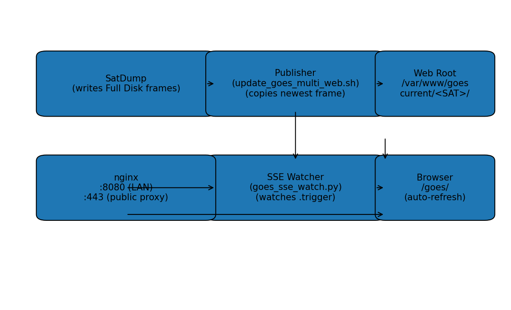
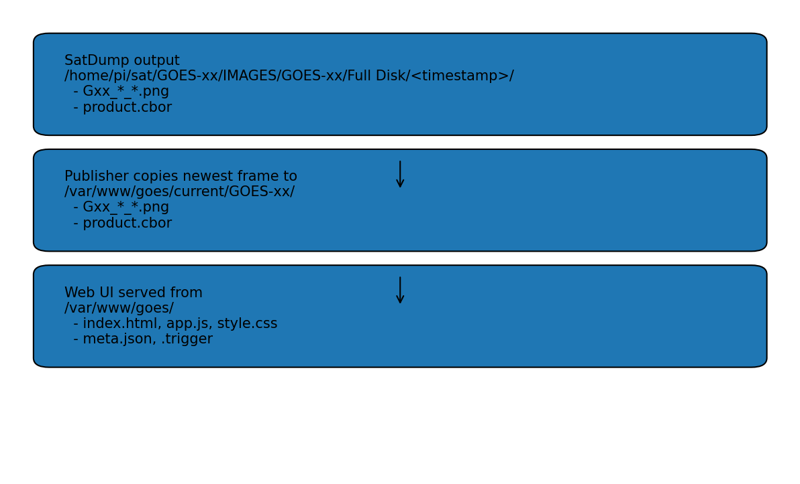

# GOES HRIT Live Web UI (Public-Safe Reverse Proxy Edition)

This repository turns **SatDump live GOES HRIT** output directories into a **live-updating web UI** with:

- **Multiple satellites** (GOES-18 and/or GOES-19) auto-detected if present
- A **static web page** that **auto-refreshes** on new frames (via **SSE**: Server-Sent Events)
- A **public-safe reverse proxy** pattern (does **not** disrupt RaspiNOAA on port 80)
- Optional: **mosaics** (channel grid, side-by-side satellites) and **timelapse MP4**

## What this is (in plain terms)

SatDump writes images into timestamped folders. This repo adds:

1. A **publisher** that copies the newest “complete” Full Disk frame into `/var/www/goes/current/<SAT>/`
2. A small **SSE watcher** that notifies browsers when a new frame arrives
3. An **nginx site** for `/goes/` (either LAN-only or public-facing via a safe reverse proxy pattern)

## Architecture



## Supported satellites

- GOES-18 (if your station can see it)
- GOES-19 (if your station can see it)

If both are present, the UI exposes both. If only one is present, only that one appears.

## Assumptions

- You are on a Raspberry Pi running RaspiNOAA (or equivalent) and **SatDump is already installed**
- SatDump is producing Full Disk imagery somewhere under `/home/pi/sat/...`
- You want to preserve RaspiNOAA’s existing nginx site on port **80**
- You want this UI at:
  - LAN: `http://<pi>/goes/`
  - Optional public: `https://<your-domain>/goes/` (reverse proxy + TLS + auth)

## Quickstart (LAN-only, safe with RaspiNOAA)

### 0) Confirm your SatDump Full Disk roots

Typical paths (yours may differ):

- `/home/pi/sat/GOES-18/IMAGES/GOES-18/Full Disk`
- `/home/pi/sat/GOES-19/IMAGES/GOES-19/Full Disk`

You can confirm with:

```bash
sudo find /home/pi/sat -type f -path '*IMAGES/GOES-*/Full Disk/*/product.cbor' 2>/dev/null | head
```

### 1) Install

Clone this repo and run the installer:

```bash
git clone https://github.com/<you>/goes-hrit-live-webui.git
cd goes-hrit-live-webui
sudo bash install/install.sh
```

### 2) Verify (single-command health check)

```bash
sudo bash install/check.sh
```

### 3) Open the UI

- `http://<pi>/goes/`

The page should load and you should see live events:

```bash
curl -N http://<pi>/goes/events
```

You should see `event: hello` followed by `event: update` entries over time.

---

## Public-safe reverse proxy (mechanic-level explanation)

A **reverse proxy** is the “front desk” for your server.

- The actual GOES web app runs on the Pi (in the “garage”).
- The reverse proxy is the “front door + receptionist”.
- It shows **only** `/goes/` to the public, blocks everything else, and can require a password.
- It also enables **HTTPS** so people can’t snoop traffic.

This repo provides a default pattern that:
- **Does not touch RaspiNOAA’s port 80 site**
- Adds a dedicated nginx site for `/goes/`
- Optionally adds a TLS-enabled **public** server block with authentication and rate limits

### Public exposure options (recommended order)

1. **VPN-only** (Tailscale/WireGuard) — safest
2. **Cloudflare Tunnel** — safe and easy
3. **Direct port-forward** with TLS + auth + rate limiting — workable, but higher risk

This repo’s nginx file shows option #3 in a locked-down way.

---

## Implementation details

### 1) “Newest frame” detection (robust)

The publisher selects the newest Full Disk timestamp directory by **mtime of `product.cbor`**,
not by lexicographic folder name (which can be wrong if multiple roots exist).

### 2) Publishing model

For each satellite detected, the publisher copies the newest frame into:

```
/var/www/goes/current/GOES-18/
/var/www/goes/current/GOES-19/
```

and writes:

- `/var/www/goes/meta.json`
- touches `/var/www/goes/.trigger`

### 3) SSE watcher (“rock of Gibraltar” mode)

The SSE service tails `.trigger` **via polling** (1 Hz) and broadcasts `event: update` to all browsers.
This is deliberately simple and resilient.

If your station stops producing frames, the UI continues running; it just receives no new updates.

### 4) RaspiNOAA compatibility

RaspiNOAA uses nginx on port **80** (`/etc/nginx/sites-enabled/default`) and serves its own web app.
We do **not** modify that site.

We add a new nginx location under the existing site (or a separate include) that routes `/goes/`
to this app root under `/var/www/goes`.

### 5) USB stability note (rtl-sdr)

If SatDump logs show:

```
Failed to submit transfer 0
Please increase your allowed usbfs buffer size...
echo 0 > /sys/module/usbcore/parameters/usbfs_memory_mb
```

Apply immediately:

```bash
echo 0 | sudo tee /sys/module/usbcore/parameters/usbfs_memory_mb
```

To persist across reboots, add this to `/etc/rc.local` or a dedicated systemd oneshot service (not included here).

---

## Files you install (what goes where)



- Web root: `/var/www/goes`
- Publisher script: `/usr/local/bin/update_goes_multi_web.sh`
- SSE watcher: `/usr/local/bin/goes_sse_watch.py`
- systemd units: `/etc/systemd/system/...`
- nginx config: `/etc/nginx/sites-available/goes-hrit-live` + symlink into `sites-enabled`

---

## How to use

### The UI

- Satellite dropdown (GOES-18 / GOES-19)
- Image dropdown (lists `Gxx_*_*.png` in the current frame)
- Auto-refresh: on every SSE `update`, the page reloads list and shows the newest image (focus-snatching by design)

### Force a publish update (manual)

```bash
sudo /usr/local/bin/update_goes_multi_web.sh
```

### Watch live events

```bash
curl -N http://localhost/goes/events
```

---

## Optional features

### A) Channel mosaic (grid)

Creates one mosaic PNG per satellite/current frame (requires ImageMagick or Pillow).

```bash
sudo /usr/local/bin/build_mosaic.py --sat GOES-19
```

### B) Side-by-side GOES-18 vs GOES-19 mosaic

```bash
sudo /usr/local/bin/build_mosaic.py --pair GOES-18 GOES-19 --band 13
```

### C) Timelapse MP4 (full disk channel)

Requires `ffmpeg`.

```bash
sudo /usr/local/bin/make_timelapse.sh GOES-19 13 24h
```

Outputs in `/var/www/goes/videos/` by default.

---

## Troubleshooting (fast, deterministic)

### 1) Is the SSE service running?

```bash
systemctl is-active goes-sse.service
```

### 2) Are publish updates happening?

```bash
stat /var/www/goes/.trigger
cat /var/www/goes/meta.json
```

### 3) Can nginx serve the “current” directory listing?

```bash
curl -sS http://localhost/goes/current/GOES-19/ | head
```

### 4) Can nginx serve an actual PNG?

```bash
FN="$(curl -sS http://localhost/goes/current/GOES-19/ | grep -Eo 'G19_[^"]+\.png' | head -n 1)"
curl -I "http://localhost/goes/current/GOES-19/$FN"
```

### 5) If “no new images”

- Confirm SatDump is still producing new `product.cbor` files:
  ```bash
  sudo find /home/pi/sat -type f -path '*Full Disk/*/product.cbor' -printf '%TY-%Tm-%Td %TH:%TM:%TS %p\n' 2>/dev/null | sort -r | head
  ```
- If SatDump logs show USB transfer failures, apply the usbfs fix and restart SatDump.

---

## Security defaults (public-safe)

See `docs/SECURITY.md` for:
- TLS configuration guidance (LetsEncrypt)
- Basic auth
- Rate limiting
- Path allowlists
- Common failure modes when exposing a home server

---

## License

MIT. See `LICENSE`.
