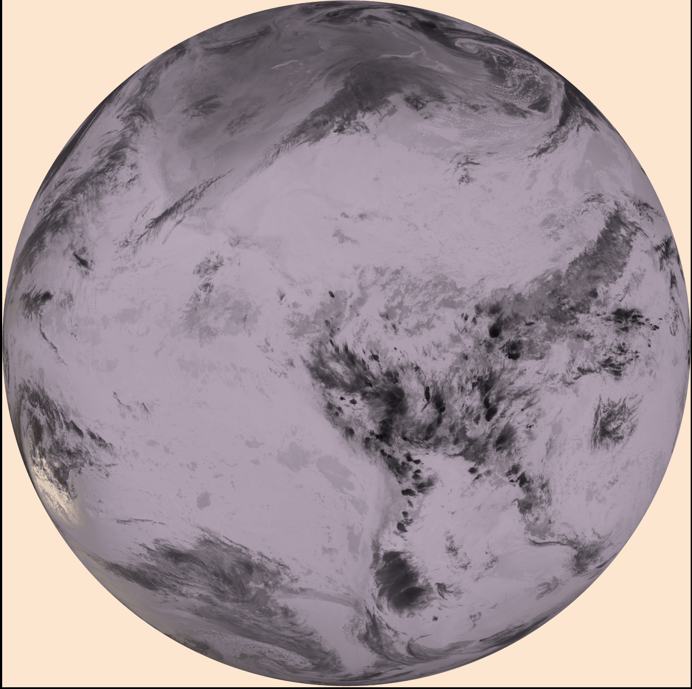
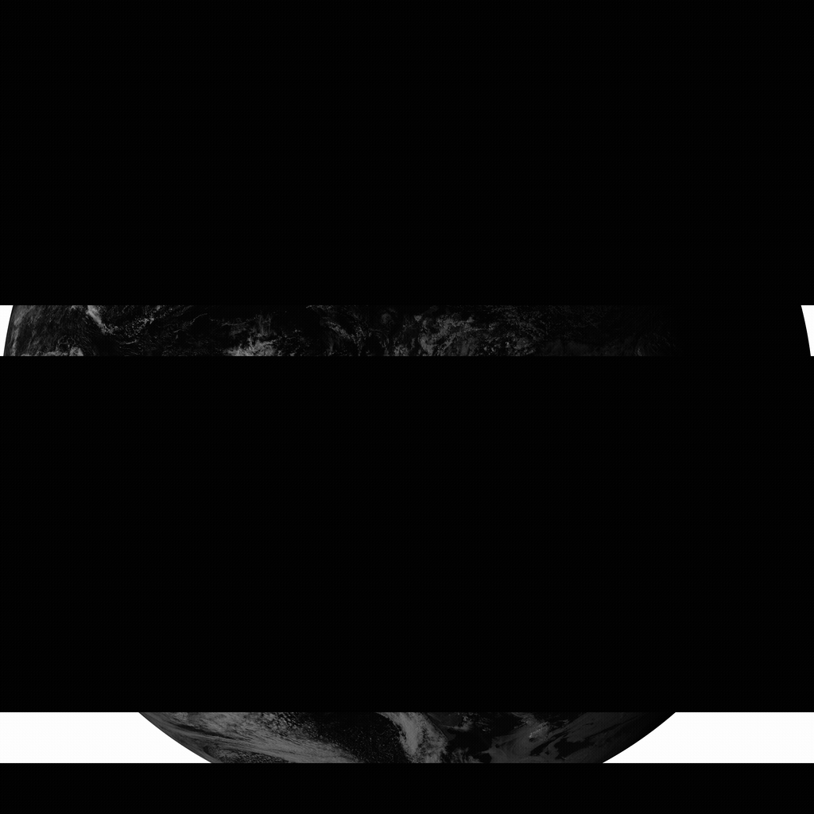
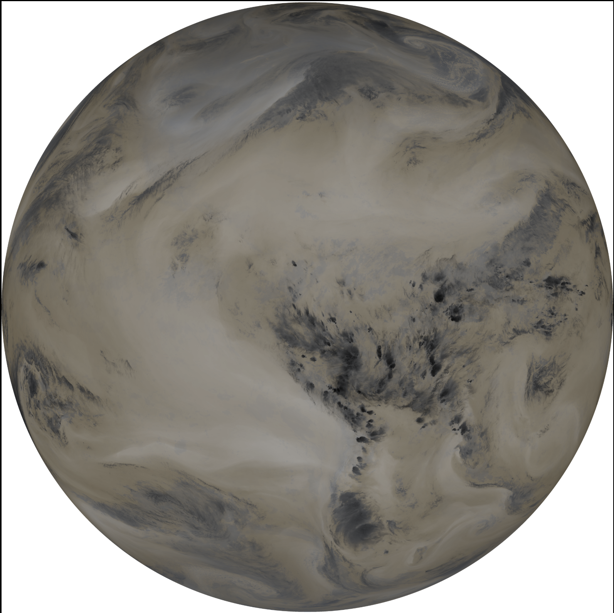
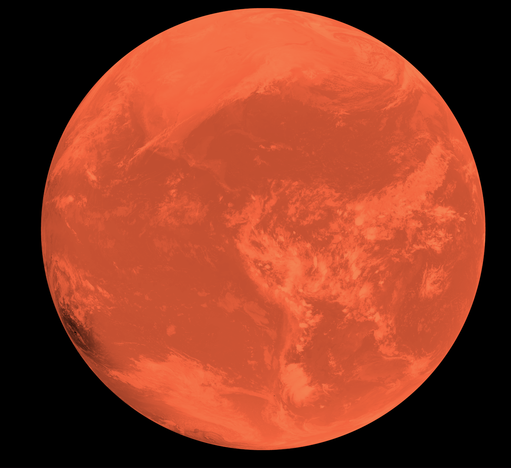
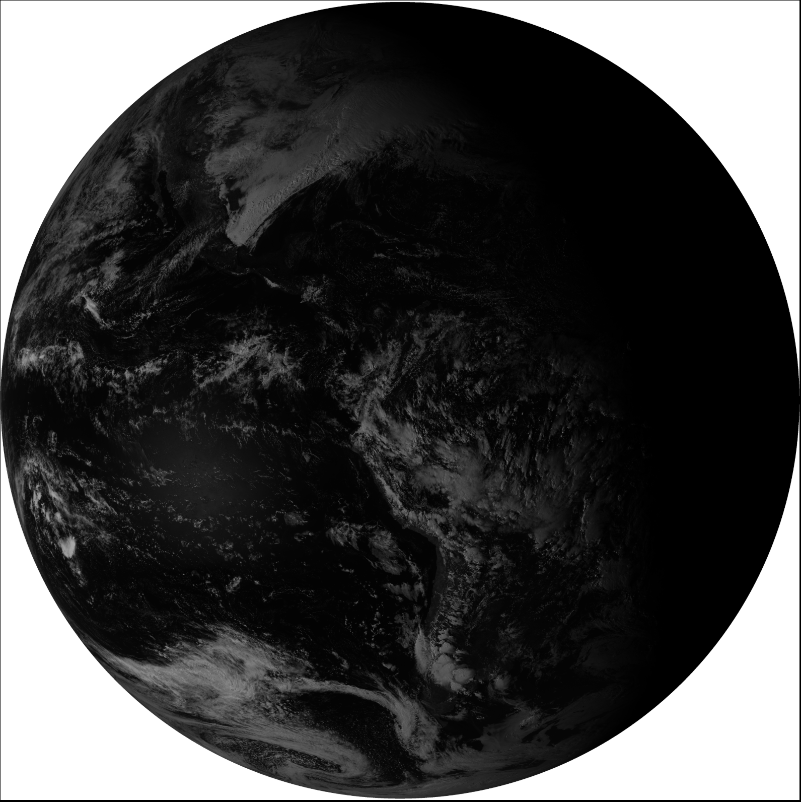

# Real-Time GOES Weather Satellite Imagery From Your Backyard

*By Dr. Robert McGwier, N4HY*

The first time the globe appeared on my screen—not from a weather website, but from radio waves I'd just pulled out of the sky—I actually laughed out loud. There it was: Earth, the whole visible hemisphere, clouds swirling over the Atlantic, a cold front knifing across the Midwest. My dish. My SDR. My Raspberry Pi. Thirty-six thousand kilometers of empty space, and I was drinking from that fire hose.

That was six months ago. Now it runs 24/7, unattended, updating every ten minutes. I've watched hurricanes organize and intensify in real-time. I've spotted wildfires before they hit the news. When a line of thunderstorms rolled through last month, I pulled up the water vapor channel and watched the atmospheric river feeding them—moisture streaming up from the Gulf like a firehose aimed at my state.

This isn't a weekend project that sits on a shelf. It's infrastructure. And yeah, you can build one too.

## Why I Built This

I'm a ham radio operator (N4HY), licensed since I was 10 years old in 1964, and I've spent my career in signal processing—including helping build FlexRadio, Inc. with SDR software I wrote and an architecture for the world's best receiver I helped conceive. As a member of AMSAT, I worked on satellite tracking software, spacecraft hardware, and helped build several successful satellites with the team by 1992. I founded Hawkeye 360, Inc. based on my SDR knowledge and satellite experience—Hawkeye 360 is now very successful. But at the heart of it, I'm a lover of satellite technology and the ways it can be used. GOES satellites give me RF, satellite systems, SDR, and serious software engineering to sink my teeth into. They're parked in geostationary orbit, beaming down high-resolution imagery continuously, and the signals are *right there* for anyone with the right hardware to receive. No license required. No API keys. No subscription fees. Just physics.

The problem was always the software side. Sure, you could decode the imagery with various tools, but then what? I wanted something my family could pull up on their phones. I wanted it to just *work*, day after day, without me babysitting it. I wanted to see a storm developing and pull up a timelapse of the last six hours with one click.

So I built it.

## The Hardware: Easier Than You Think

Here's the beautiful thing: you don't need to source exotic components from five different vendors. Nooelec sells a complete GOES reception kit, all on Amazon, all designed to work together. I spent about $175 and an afternoon.

The signal chain is simple:

```
Antenna Feed → FM Bandstop → SAWbird LNA → Coax → SDR → Raspberry Pi
```

**[The Dish](https://a.co/d/5X87izo)** (~$90): Nooelec's BBQ grill section of a parabolic reflector has sufficient efficiency and effective surface area to provide 21 dBi gain. Yeah, the forums will tell you that you need a meter-wide dish minimum. They're wrong—or at least, they were before Nooelec's LNA came along. This thing works.


**[The SAWbird LNA](https://a.co/d/dxBj0aZ)** (~$35): This is the secret sauce. A filtered low-noise amplifier that takes the whisper-quiet signal from 36,000 km away and boosts it while rejecting everything else. It's bias-tee powered, so it draws power right through the coax from the SDR. One less cable, one less power supply.


**[FM Bandstop Filter](https://a.co/d/2csqoZV)** (~$15): I almost skipped this. Don't skip this. FM broadcast stations are *everywhere*, and they're loud enough to overload your SDR's front end even though they're nowhere near 1.7 GHz. Intermodulation is a harsh mistress. Fifteen bucks for clean signals.


**[The SDR](https://a.co/d/9rSrJn6)** (~$35): Nooelec NESDR SMArTee XTR. Built-in bias-tee to power the LNA, TCXO for frequency stability. Cheap RTL-SDRs drift with temperature—not what you want when you're trying to stay locked on a signal for weeks at a time.


Connect it all up, plug into a Raspberry Pi 5, and you've got a ground station. Total cost under $250 including the Pi.

## Pointing the Dish: The Fun Part

GOES satellites are geostationary—they hang in one spot in the sky, so you only aim once. But you have to aim *accurately*. The beam width on even a small dish is just a few degrees.

I used [N2YO's satellite tracker](https://www.n2yo.com/) to get my azimuth and elevation. For GOES-19 from the East Coast, it's roughly due south, about 45 degrees up. I set the rough angles with a compass and a phone inclinometer, then fired up SatDump for the fine tuning.

Here's the moment of truth: you're watching the Viterbi error rate in SatDump, slowly adjusting the dish by quarter-turns of the mounting bolts. Too far left—error rate climbs. Back a bit—drops. Nudge the elevation—drops more. You're hunting for the sweet spot, and when you find it...

The error rate plummets below 500. The SNR climbs to 6 or 7 dB. "LOCKED" appears on the decoder status. And then the first image starts rendering.

I may have fist-pumped. Don't judge.

## SatDump: The Heart of Everything

None of this works without [SatDump](https://github.com/SatDump/SatDump). Created by Aang23 and a community of contributors, it's an absolute masterpiece of open-source software. SatDump handles the entire receive chain:

- Talks directly to your SDR
- Demodulates the BPSK signal
- Runs Viterbi decoding on the convolutionally-coded bitstream
- Applies Reed-Solomon error correction
- Demultiplexes the data streams
- Decompresses JPEG2000 imagery
- Writes beautiful, timestamped PNG files to disk

All in real-time. On a Raspberry Pi. I still find this slightly miraculous.

I run it headless as a systemd service:

```bash
satdump live goes_hrit . --source rtlsdr --samplerate 2.4e6 --frequency 1694.1e6 --gain 40
```

A few notes on those flags, because they matter:

- **`--samplerate 2.4e6`**: GOES HRIT runs at 927 kbaud. You need at least ~1.8 MHz of bandwidth, so 2.4 MHz gives you comfortable margin.
- **`--frequency 1694.1e6`**: The HRIT downlink. Same for both GOES-18 and GOES-19—you receive whichever one your dish is pointed at.
- **`--gain 40`**: With the SAWbird providing 22 dB of gain ahead of the SDR, you don't need to crank this to maximum. I tuned it by watching the Viterbi error rate—too high means clipping, too low means the signal's buried in noise.

Every ten minutes or so, a new Full Disk image appears. Every minute, the Mesoscale sectors update—those are the zoomed-in, high-resolution shots that NOAA points at storms and wildfires. It's mesmerizing to watch.

## The Web UI: Because I Wanted It On My Phone

Raw images in a folder are great, but I wanted more. I wanted to pull up my phone and see what's happening *right now*. I wanted to scrub back through the last day of imagery. I wanted animated timelapses. I wanted false-color composites that show things human eyes can't see.

So I built a web interface.



The architecture is deliberately over-engineered for reliability. A publisher script runs every 60 seconds, finds the newest complete frame (SatDump writes a marker file when it's done), and copies it to the web root. Only complete frames ever get published—no partial images, ever.

A Python SSE (Server-Sent Events) daemon watches for changes and pushes notifications to connected browsers. No polling. No stale caches. When a new image arrives, your browser knows within seconds.

The interface has five modes:

**Live Mode**: Real-time imagery with automatic refresh. Pick your satellite, your sector, your band. When GOES sends a new frame, you see it.

**History Browser**: Scrub back through hours or days of archived imagery. That perfect cloud formation you saw earlier? Go find it.

**Timelapse**: Select a band, a time window, and a frame count. Click Generate. Watch six hours of weather compressed into a few seconds of smooth animation.



**False Color**: This is where it gets fun. The raw bands are grayscale, but combine them right and you see things that aren't visible to the naked eye:

- **Day/Night**: Blends visible light during the day with infrared at night. Clouds stay visible around the clock.
- **Fire Detection**: CH7 (shortwave IR) lights up hot spots. I've seen wildfires appear as bright pixels hours before they made the news.
- **Water Vapor**: CH8 at 6.2 μm reveals upper-atmosphere moisture. Jet streams, atmospheric rivers, the invisible rivers of air that drive our weather—suddenly visible.





**EMWIN**: GOES also broadcasts text products for emergency managers—forecasts, warnings, watches. The interface lets you browse and read them.



## The Stuff That Surprised Me

**How often it just works.** I expected to babysit this thing. I expected crashes, lockups, mysterious failures at 3 AM. Instead, it's been running for months. SatDump is rock-solid. The systemd services restart cleanly if anything hiccups. I check on it maybe once a week, mostly just to admire the latest imagery.

**How much you actually receive.** I knew I'd get images. I didn't expect to get *continuous* images. Every ten minutes, the whole hemisphere. Every minute, the mesoscale sectors. EMWIN text products. It's a firehose.

**The link budget actually works.** On paper, receiving a signal from 36,000 km with a $90 dish seems sketchy. In practice, I get 6-7 dB SNR all day, every day. The Viterbi error rate sits comfortably below 200. The concatenated coding that GOES uses is remarkably robust.

**How addictive weather-watching becomes.** I never cared much about weather before. Now I check the water vapor channel like some people check Twitter. There's something different about watching weather systems develop when you *know* those photons just bounced off your dish.

## Build Your Own

Everything is open source: [github.com/n4hy/goes-hrit-live-webui](https://github.com/n4hy/goes-hrit-live-webui)

### Shopping List

All on Amazon, ~$175 for RF hardware:

- [Nooelec GOES Antenna System](https://a.co/d/5X87izo) - the dish and helix feed
- [Nooelec SAWbird+ GOES LNA](https://a.co/d/dxBj0aZ) - the magic amplifier
- [Nooelec FM Bandstop Filter](https://a.co/d/2csqoZV) - keeps FM stations from wrecking your day
- [Nooelec NESDR SMArTee XTR](https://a.co/d/9rSrJn6) - the SDR with TCXO and bias-tee
- Raspberry Pi 5, power supply, SD card
- Mounting hardware for your situation

### Installation

Install SatDump (they have apt packages for Raspberry Pi OS), point your dish using N2YO and the Viterbi error rate, then:

```bash
git clone https://github.com/n4hy/goes-hrit-live-webui ~/goes-hrit-live-webui
cd ~/goes-hrit-live-webui
sudo bash install/install.sh
```

That's it. The installer sets up nginx, systemd services, everything. Point a browser at your Pi's IP on port 8080 and wait for the first image.

It'll appear in about ten minutes. The globe will fill in, band by band. And you'll understand why I laughed out loud.

## What's Next

The bones are solid. The architecture scales. There's more I want to add:

- **Geographic overlays**: State and country boundaries, lat/lon grids
- **Multi-satellite composites**: Merge GOES-West and GOES-East for coast-to-coast coverage
- **Storm detection**: ML-based identification of developing convection
- **APRS integration**: Push alerts to ham radio networks

But honestly? Most days I just watch the globe turn, the clouds swirl, the weather happen. Real-time. From space. From my backyard.

That never gets old.

---

Accolades: Claude  was magnificent with the WEB UI!!

---

*Dr. Robert McGwier (N4HY) is a signal processing researcher and amateur radio operator. This project runs 24/7 from his home, pulling down satellite imagery while he sleeps. The complete source code is available at [github.com/n4hy/goes-hrit-live-webui](https://github.com/n4hy/goes-hrit-live-webui).*
